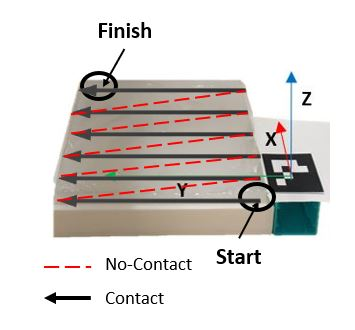

X, Y and Z are script used to train the network.
Run one model at time and saved the network.
Then use tracking to simulate an online prediction.

# ARTEMIS
Advanced Robotic Breast Examination Intelligent System-- funded by **Cancer Research UK** ***C24524/A30038*** aims at developing an intelligent system for robotic palpation helping with early breast cancer detection.

## Table of Contents
* [deep_pdp](https://github.com/imanlab/artemis_dpd/) contains Deep learning models from demonstrations.
* [About the project](About-The-Project)
* [System Requirements](#System-Requirements)
* [Installation](#Installation)
  * [Datasets](#Datasets)
  * [Training](#Training)

## About The Project
Early cancer detection is of utmost importance as it can allow faster, simpler and more effective treatment, hence saving many lives. Breast self-examination, expert palpation and Mammography are currently the means of detecting breast cancer. Expert and Self-examination are composed of a visual inspection of the breasts and palpation of the breasts and lymph nodes. Nonetheless, these are subjective approaches and may result in many false negative. On the other hand, in mammography, the body is exposed to radiation.

Hence, early breast cancer detection is not well practised illustrating a technology gap. Robot palpation is a solution to fill this gap. For example, during robotic minimally invasive surgery, palpation is essential to identify anomalies. Nowadays, the palpation action for breast cancer detection is performed by the patient, consequently of the subjects, the diagnosis is not always reliable, or by expert which is not convenient for many subjects, revealing an autonomous robot for palpation an interesting solution.

This project is on motion/Path planning from demonstrations](https://github.com/imanlab/artemis_dpd) -- developed by [Marta Crivellari](https://www.linkedin.com/in/marta-crivellari-11231b1ba/?originalSubdomain=it) on a phantom silicon model.

  

## System Requirements
All the experiments can be run on Tensorflow2 and Keras >=2.2.0. We have used Tensorflow-gpu 2.2 with a NVIDIA GeForce RTX2080 graphic card with 8GB memory with CUDA 11.0 for training on Ubuntu 18.04.

- **Tensorflow-gpu 2.2**
- **NVIDIA GeForce RTX2080**
- **CUDA 11.0**
- **Ubuntu 16.04**
- **ROS KInetic**

## Installation
To use the artemis_dpd repository, you must first install the project dependencies. This can be done by install miniconda3 from here with python 3 and running:

pip install -r requirements.txt

## Datasets
The datasets can be found in the palpation_data folder. We have obtained the datasets through ROS and our internal framework for Franka Robots.

## References

The references used for your work (research papers, blogs, books,etc.) can be listed here.

## Contact

Provide a list of developers/maintainers email-ids of the repository so as to help resolve the issues future users may come across.

## Acknowledgements

If your work is an extension of an existing repository/research work, the original work can be mentioned here.
This template is inspired from a great template made available by @othneildrew at https://github.com/othneildrew/Best-README-Template/blob/master/README.md.
